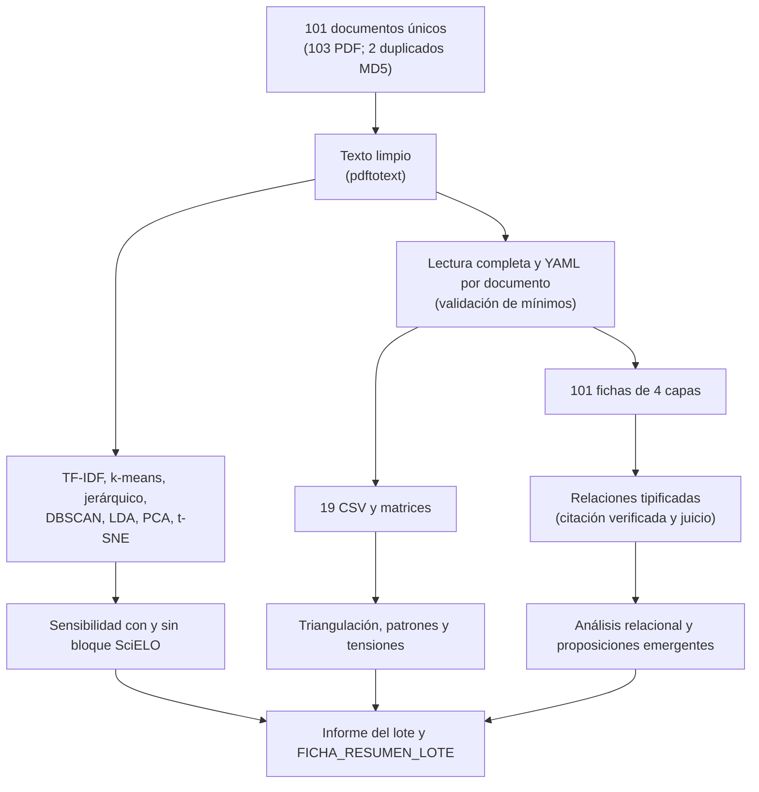
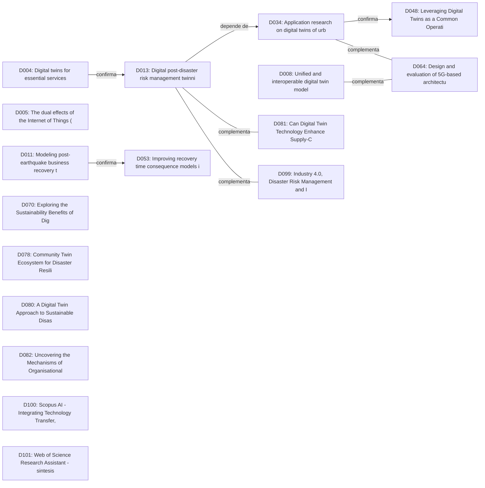
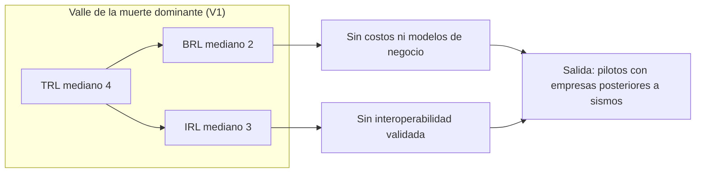

# Diagramas Mermaid del lote L01

## Flujo de proceso

```mermaid
flowchart TD
  A["101 documentos únicos\n(103 PDF; 2 duplicados MD5)"] --> B["Texto limpio\n(pdftotext)"]
  B --> C["Lectura completa y YAML por documento\n(validación de mínimos)"]
  C --> D["101 fichas de 4 capas"]
  B --> E["TF-IDF, k-means, jerárquico,\nDBSCAN, LDA, PCA, t-SNE"]
  C --> F["19 CSV y matrices"]
  E --> G["Sensibilidad con y sin bloque SciELO"]
  F --> H["Triangulación, patrones y tensiones"]
  D --> I["Relaciones tipificadas\n(citación verificada y juicio)"]
  I --> J["Análisis relacional y proposiciones emergentes"]
  G --> K["Informe del lote y FICHA_RESUMEN_LOTE"]
  H --> K
  J --> K
```

## Relaciones entre documentos del núcleo

```mermaid
graph LR
  D004["D004: Digital twins for essential services"]
  D005["D005: The dual effects of the Internet of Things ("]
  D008["D008: Unified and interoperable digital twin model"]
  D011["D011: Modeling post-earthquake business recovery t"]
  D013["D013: Digital post-disaster risk management twinni"]
  D034["D034: Application research on digital twins of urb"]
  D048["D048: Leveraging Digital Twins as a Common Operati"]
  D053["D053: Improving recovery time consequence models i"]
  D064["D064: Design and evaluation of 5G-based architectu"]
  D070["D070: Exploring the Sustainability Benefits of Dig"]
  D078["D078: Community Twin Ecosystem for Disaster Resili"]
  D080["D080: A Digital Twin Approach to Sustainable Disas"]
  D081["D081: Can Digital Twin Technology Enhance Supply-C"]
  D082["D082: Uncovering the Mechanisms of Organisational "]
  D099["D099: Industry 4.0, Disaster Risk Management and I"]
  D100["D100: Scopus AI - Integrating Technology Transfer,"]
  D101["D101: Web of Science Research Assistant - sintesis"]
  D034 -->|confirma| D048
  D034 ---|complementa| D064
  D008 ---|complementa| D064
  D004 -->|confirma| D013
  D013 ---|complementa| D081
  D013 ---|complementa| D099
  D011 -->|confirma| D053
  D013 -->|depende de| D034
```

## Estructura del valle de la muerte

```mermaid
flowchart LR
  subgraph Valle["Valle de la muerte dominante (V1)"]
    T["TRL mediano 4"] --> B["BRL mediano 2"]
    T --> I["IRL mediano 3"]
  end
  B --> X["Sin costos ni modelos de negocio"]
  I --> Y["Sin interoperabilidad validada"]
  X --> Z["Salida: pilotos con empresas posteriores a sismos"]
  Y --> Z
```
